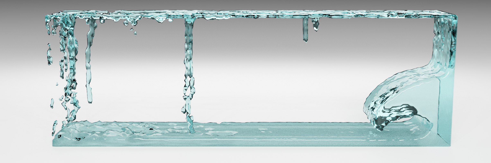
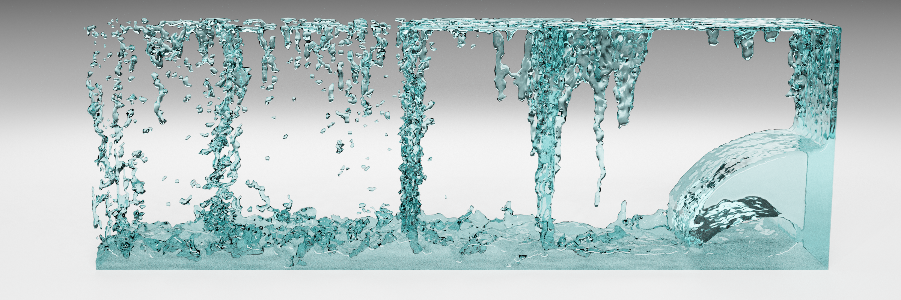

# FluidSimulation - I




Fluid simulation via FLIP (Fluid Implicit Particle) Method.


# Cloning with submodules

This Git repository has a submodule for libigl. To clone it correctly use the following command:

    git clone --recurse-submodules git@github.com:SeanBone/WaterSim.git

For more details on the dependencies for `libigl`, check out the [`libigl` documentation](https://libigl.github.io/tutorial/).

### Note for linux users

On Ubuntu, install the following dependencies:

```
sudo apt-get install cmake build-essential libnetcdf-c++4-dev libx11-dev mesa-common-dev libgl1-mesa-dev libglu1-mesa-dev libxrandr-dev libxi-dev libxmu-dev libblas-dev libxinerama-dev libxcursor-dev
```

If you are using linux with a virtual machine on Windows, it is *recommended* to use **Visual Studio** instead.

### Note for Windows users

`libigl` supports the **Microsoft Visual Studio 2015** compiler and later, in *64bit* mode. You can download *Visual Studio 2019 Community* for free from [here](https://visualstudio.microsoft.com/vs/).

# Compiling and running

The main simulation is in the folder `3d`. It can be compiled with Make and CMake:

    mkdir -p 3d/build/
    cd 3d/build && cmake ..
    make -j8

## Simulation parameters

`watersim` has several options. Note that in GUI mode, the simulation must be reset before any changes to settings are applied (except the render options, which only affect the viewport and not the simulation itself).

 - Mesh wireframe: render a wireframe of the mesh representing the water surface.
 - Mesh fill: render the mesh representing the water surface.
 - Max particles display: when running a large simulation, rendering all the particles causes the libigl GUI to lag significantly. Therefore a maximum number of particles to render can be selected. This does not affect the number of particles actually used in simulation.
 - Show grid: whether to render the MAC grid which is used for simulation.
 - Export meshes: whether to generate `*.obj` files for each frame (see below)
 - Randomize particles: if checked, the initial particle positions are jittered slightly instead of being on a strict 2x2x2 grid in their starting cell.
 - Random seed: the random seed to use for particle initialization.
 - Meteor force: if checked, the `FLIP::explode` method will be called at each step, generating the "meteor splash" effect.
 - Alpha: the mixing parameter for FLIP and PIC methods. `alpha = 1` means pure PIC, `alpha = 0` means pure FLIP.
 - Timestep: timestep used for simulation, in seconds.
 - Max steps: how many steps to run the simulation for. If negative, no limit is set.
 - The density of the fluid, in kg/m^3
 - Acceleration of gravity in m/s^2
 - Grid resolution XYZ: the number of cells along the corresponding direction (axis)
 - Size XYZ: the size in metres of the simulation environment.
 - Fluid region: used to select a region to be filled with fluid at the start of the simulation. It is specified by two points (coordinates in meters) which define an axis-aligned bounding box. All cells whose center lies in this region are flagged as fluid.


## Viewport navigation in GUI mode

In GUI mode you can navigate using the following controls:
- Left mouse button to rotate
- Right mouse button to pan
- Scroll to zoom
If at first it seems like the viewport is empty, try zooming out ;)


# References

See the `docs` folder for some useful PDFs.

- C. Amevor, S. Bone, F. Illes, M. Stellio, "Optimisation of a FLIP algorithm", report for the Advanced Systems Lab lecture at ETH Zürich, spring semester 2021.
- R. Bridson, "FLUID SIMULATION", SIGGRAPH 2007 Course Notes. [Available online](https://www.cs.ubc.ca/~rbridson/fluidsimulation/fluids_notes.pdf).
- D. Englesson, J. Kilby, J. Ek, "Fluid Simulation Using Implicit Particles", report for the Advanced Game Programming lecture at Linköpings universitet, December 2011. [Available online](http://danenglesson.com/flipfluid.html).
